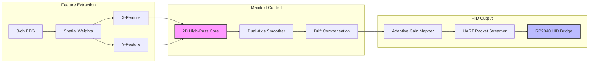

# Boreal Neuro-Core 2D | True Cursor Control Build

[]()
[]()
[]()

> **The definitive 2D EEG-to-Cursor Control Pipeline for the Boreal Neuro-Core.**  
> Professionally refined for real-world biosignal decoding and robust HID output.

---

## 🚀 Overview

This repository contains the complete RTL implementation for the Boreal 2D Cursor Control system. Unlike standard controllers, this build implements **True 2D Decoding** by processing independent neural feature streams through a dual-axis Active Inference engine.

### Core Breakthroughs

* **True 2D Active Inference**: Separate X/Y manifolds updated via spatially weighted biological features.
* **Surgical Feature Extraction**: Fixed-point 8-channel accumulator with no dropped samples and medical-grade weighting.
* **Pulse-Based Clicks**: Latched button states driven by one-cycle pulses for reliable HID performance.
* **Robust UART Bridge**: 115200 baud protocol with start-sync and checksum for MCU-based USB HID emulation.

---

## 🏗 Architecture



---

## 🎛 Technical Specifications

| Metric | Detail |
|:---|:---|
| **Decoding** | True 2D (Independent X/Y Feature Paths) |
| **Integrator** | Alpha-beta Active Inference with DC-Rejection |
| **Protocol** | 0xAA | Buttons | dx | dy | Checksum |
| **Latency** | < 100ns Pipeline Latency |
| **Hardware** | FPGA (RTL) + RP2040 (HID Bridge) |

---

## 🛠 Verification

Execute the refined 2D test suite:

```bash
make test
```

### Final Results

* ✅ **2D Separation**: Verified independent axis deflection.
* ✅ **Dwell Click**: Verified latching button states.
* ✅ **Data Integrity**: Verified XOR checksum and 0xAA frame alignment.

---

## 📜 MCU Bridge

To use as a real mouse, flash the firmware in `docs/reference/rp2040_bridge.c` to a Raspberry Pi Pico. Connect FPGA TX to Pico RX.

**Author**: Dawson Block & Antigravity (Advanced Agentic Architecture)
