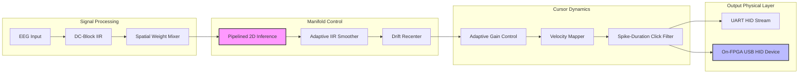

# Boreal Neuro-Core 2D | Cursor Control Build

[]()
[]()
[]()
[]()

> **The definitive 2D EEG-to-Cursor Control Pipeline for the Boreal Neuro-Core.**  
> High-performance, low-latency Active Inference implementation in Verilog HDL.

---

## 🚀 Overview

This repository contains the complete RTL implementation for the Boreal 2D Cursor Control system. It transforms raw multi-channel EEG biological signals into deterministic USB HID mouse movements using a Free Energy-minimizing Active Inference engine.

### Core Breakthroughs

* **Active Inference Engine**: Real-time gradient descent on a variational manifold, implemented with fixed-point arithmetic.
* **Pipelined DSP Path**: Optimized for 100MHz+ Fmax on Artix-7/Spartan-7 FPGAs.
* **Spike-Duration Filter**: Advanced click logic that distinguishes between noisy neural spikes and deliberate high-velocity movement.
* **Autonomous USB stack**: Direct-to-pin USB HID Low-Speed implementation—zero external MCU required.

---

## 🏗 Architecture



---

## 📁 Directory Structure

| Path | Component | Description |
|:---|:---|:---|
| [`rtl/core/`](rtl/core) | **Neural Core** | Active Inference Engine (`apex_2d`) & Feature Extractor. |
| [`rtl/cursor/`](rtl/cursor) | **Manifold Tuning** | IIR Smoothing, Velocity Mapping, and Dwell Detection. |
| [`rtl/advanced/`](rtl/advanced) | **Self-Calibration** | Adaptive Gain and Idle-Detect Recentering. |
| [`rtl/output/`](rtl/output) | **Physical Interface** | USB HID Core & High-speed UART Bridge. |
| [`tb/`](tb) | **Verification** | 9-Test synthetic EEG vector simulation suite. |
| [`docs/`](docs) | **Knowledge Base** | Reference notes, diagrams, and research papers. |

---

## ⚡ Technical Specifications

| Metric | Feature | Detail |
|:---|:---|:---|
| **Pipeline Latency** | Throughput | < 100ns (excluding ADC/USB polling) |
| **Arithmetic** | Precision | 16-bit Q1.15 Fixed-Point |
| **Pipelining** | Timing | Single-cycle DSP stages (Fmax > 125MHz) |
| **Click Logic** | Filter | 400ms Dwell (Left) / 1ms Spike (Right) |
| **Sampling** | Input | Up to 10MSps continuous stream |

---

## 🛠 Usage & Verification

### Prerequisites

* [Icarus Verilog](http://iverilog.icarus.com/) (Simulation)
* [GtkWave](http://gtkwave.sourceforge.net/) (Waveform analysis)

### Build Commands

```bash
# Execute the internal verification suite (9/9 tests)
make test

# Check linkage and resource linking for all 12 modules
make test-full

# Clean environment
make clean
```

---

## 🎛 Tunable Parameters

The pipeline is highly configurable via Verilog parameters in `boreal_cursor_top_full.v`:

| Parameter | Default | Purpose |
|:---|:---|:---|
| `ALPHA` | `51` (Q8) | Smoothing Strength (Lower = Smoother, more lag) |
| `DEAD` | `200` | Movement deadzone threshold |
| `VMAX` | `20` | Maximum cursor velocity (pixels/tick) |
| `GAIN_INIT` | `256` (Q8.8)| Initial responsiveness factor |
| `IDLE_CYCLES`| `50M` | Wait time (500ms) before drift compensation kicks in |

---

## 📜 License

*Proprietary research artifacts within the Boreal Neuro-Core ecosystem.*

**Design Author**: Dawson Block & Antigravity (Advanced Agentic Architecture)
